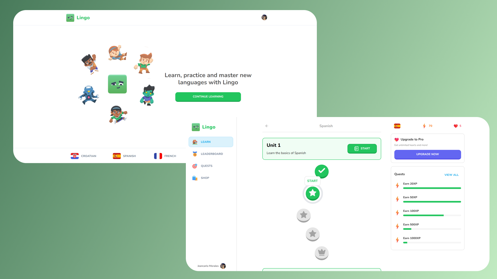

# Lingo - (Duolingo Clone)



## 🦞 Folder Structure

```bash
duolingo-clone/
  |- actions/
    |-- challenge-progress.ts
    |-- user-progress.ts
    |-- user-subscription.ts
  |- app/
    |-- (auth)
      |-- sign-in
        |-- [[...sign-in]]
          |-- page.tsx
      |-- sign-up
        |-- [[...sign-up]]
          |-- page.tsx
      |-- layout.tsx

```

## 🌟 Getting Started

1. Make sure **Git** and **NodeJS** is installed.
2. Clone this repository to your local computer.
3. Create `.env` file in **root** directory.
4. Contents of `.env`:

```env
# .env

# disabled next.js telemetry
NEXT_TELEMETRY_DISABLED=1

# clerk auth keys
NEXT_PUBLIC_CLERK_PUBLISHABLE_KEY=pk_test_XXXXXXXXXXXXXXXXXXXXXXXXXXXXXXXXXXXXXXXXXXXXXXXXXXXXXXXXX
CLERK_SECRET_KEY=sk_test_XXXXXXXXXXXXXXXXXXXXXXXXXXXXXXXXXXXXXXXXXXXXXXXX

# neon db uri
DATABASE_URL="postgresql://<user>:<password>@<host>:<post>/lingo?sslmode=require"

# stripe api key and webhook
STRIPE_API_SECRET_KEY=
STRIPE_WEBHOOK_SECRET=

# public app url
NEXT_PUBLIC_APP_URL=http://localhost:3000

# clerk admin user id(s) separated by comma and space (, )
CLERK_ADMIN_IDS="user_xxxxxxxxxxxxxxxxxxxxxxxxxxxxx"
# or CLERK_ADMIN_IDS="user_xxxxxxxxxxxxxxxxxxxxxxxxxxxxx, user_xxxxxxxxxxxxxxxxxxxxxx" for multiple admins.

```

5. Obtain Clerk Authentication Keys

   1. **Source**: Clerk Dashboard or Settings Page
   2. **Procedure**:
      - Log in to your Clerk account.
      - Navigate to the dashboard or settings page.
      - Look for the section related to authentication keys.
      - Copy the `NEXT_PUBLIC_CLERK_PUBLISHABLE_KEY` and `CLERK_SECRET_KEY`
        provided in that section.

6. Retrieve Neon Database URL

   1. **Source**: Database Provider (e.g., Neon, PostgreSQL)
   2. **Procedure**:
      - Access your database provider's platform or configuration.
      - Locate the database connection details.
      - Replace `<user>`, `<password>`, `<host>`, and `<port>` placeholders in
        the URI with your actual database credentials.
      - Ensure to include `?sslmode=require` at the end of the URL for SSL mode
        requirement.

7. Fetch Stripe API Key and Webhook Secret

   1. **Source**: Stripe Dashboard
   2. **Procedure**:
      - Log in to your Stripe account.
      - Navigate to the dashboard or API settings.
      - Find the section related to API keys and webhook secrets.
      - Copy the `STRIPE_API_SECRET_KEY` and `STRIPE_WEBHOOK_SECRET`.

8. Specify Public App URL

   1. **Procedure**:
      - Replace `http://localhost:3000` with the URL of your deployed
        application.

9. Identify Clerk Admin User IDs

   1. **Source**: Clerk Dashboard or Settings Page
   2. **Procedure**:

      - Log in to your Clerk account.
      - Navigate to the dashboard or settings page.
      - Find the section related to admin user IDs.
      - Copy the user IDs provided, ensuring they are separated by commas and
        spaces.

10. Save and Secure:

- Save the changes to the `.env` file.

11. Install Project Dependencies using `npm install --legacy-peer-deps` or
    `yarn install --legacy-peer-deps`.

12. Run the Seed Script:

In the same terminal, run the following command to execute the seed script:

```bash
npm run db:push && npm run db:prod
```

This command uses `npm` to execute the Typescript file (`scripts/prod.ts`) and
writes challenges data in database.

13. Verify Data in Database:

Once the script completes, check your database to ensure that the challenges
data has been successfully seeded.

14. Now app is fully configured 👍 and you can start using this app using either
    one of `npm run dev` or `yarn dev`.

**NOTE:** Please make sure to keep your API keys and configuration values secure
and do not expose them publicly.

## 🧑🏻‍💻 Tech Stack

[](https://react.dev/ 'React JS')
[](https://nextjs.org/ 'Next JS')
[](https://www.typescriptlang.org/ 'Typescript')
[](https://tailwindcss.com/ 'Tailwind CSS')
[](https://vercel.app/ 'Vercel')
[](https://www.postgresql.org/ 'Postgresql')

## 🚉 Stats

[](https://pagespeed.web.dev/analysis?url=https://lingo-clone.vercel.app/ 'Stats for Lingo')
